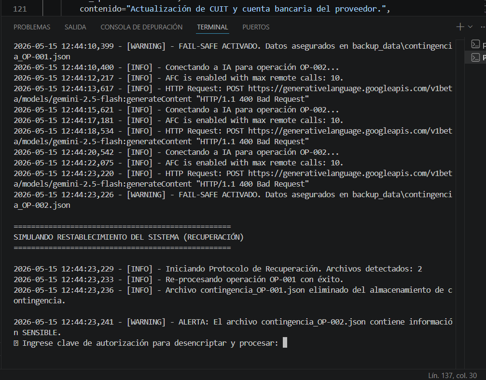

# 🛡️ Data Resilience & Fail-Safe Architecture for AI Systems

Las implementaciones de IA suelen tener un punto ciego crítico: **la dependencia absoluta de APIs externas**. Cuando un proveedor (OpenAI, Google) sufre caídas o la red local experimenta micro-cortes, las empresas pierden datos entrantes, leads comerciales y, en consecuencia, ingresos.

Este proyecto resuelve ese problema de raíz mediante una arquitectura de persistencia local y recuperación clasificada, garantizando **cero pérdida de datos operativos**.

## 🧠 El Enfoque de la Solución
Como especialista en estructuración de datos y resolución de problemas operativos, diseñé este sistema para actuar como la "caja negra" de una infraestructura. Si el proceso falla, el sistema no se rompe: captura la excepción, evalúa la sensibilidad de la información y la asegura.

### Características Principales:
- **Tolerancia a Fallos (Retry Logic):** Implementación de `Tenacity` para manejar micro-cortes de red mediante reintentos con retroceso exponencial.
- **Validación Estricta de Datos:** Uso de `Pydantic` para garantizar que la información en tránsito mantenga su integridad y formato antes de tocar la base de datos.
- **Enrutamiento por Clasificación de Sensibilidad:** El usuario define qué flujos de datos son comunes y cuáles son críticos. 
- **Recuperación con Control de Acceso (Auth-Gate):** Al restablecerse el sistema, los datos comunes se procesan automáticamente (Zero-Touch), pero la información marcada como `sensible` (ej. datos financieros o personales) queda bloqueada y exige autorización por credenciales para ser reinyectada al flujo.

## 📸 Demostración de Ejecución

A continuación se observa el sistema gestionando una falla de conexión y activando el protocolo de seguridad:

## ⚙️ Stack Tecnológico
- **Python 3.10+**
- **Pydantic** (Data Parsing & Validation)
- **Tenacity** (Resilience & Retry mechanisms)
- **Logging** (Auditoría corporativa y trazabilidad)

## 🚀 Caso de Uso Real
Ideal para operaciones que procesan alto volumen de información entrante (sistemas de tickets, extracción de datos de facturación, calificación de leads). Si el puente de conexión se cae, el sistema desvía el tráfico al almacenamiento de contingencia. Una vez restablecida la red, el operador ejecuta el script de recuperación auditada.

---
*Desarrollado para transformar procesos frágiles en infraestructuras robustas y escalables.*
